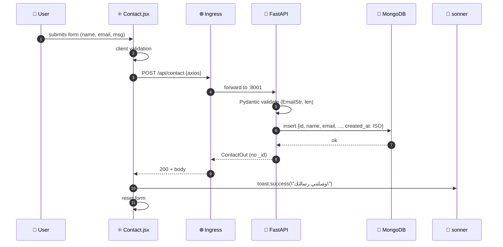

"<div align=\"center\">


<br />

# `Osama Al-Huwaish` <br /> أسامة الهويش — Portfolio

### *A scroll-scrubbed, bilingual editorial portfolio · React 19 · FastAPI · MongoDB*

<br />

[](https://react.dev)
[](https://fastapi.tiangolo.com)
[](https://www.mongodb.com)
[](https://tailwindcss.com)
[](#-license)

[]()
[]()
[]()
[]()

<br />

**[ Live preview ](#) · [ Case study : HSK App ](#-projects) · [ Case study : My AI BOT ](#-projects) · [ Contact ](#-contact)**

<br />

> *\"Built around the learner — not around the content.\"*
>
> An ambitious student's portfolio, designed like an Awwwards site. Scroll-controlled video hero, AR ↔ EN with full RTL/LTR swap, two case studies, and a premium AI-chat preview that's intentionally — *and beautifully* — closed.

</div>

<br />

---

## 📑 Table of Contents

<table>
  <tr>
    <td>

**Overview**
1. [About this project](#-about-this-project)
2. [Highlights](#-highlights)
3. [Live gallery](#-live-gallery)

**Tech**
4. [Tech stack](#-tech-stack)
5. [Architecture](#-architecture)
6. [File tree](#-file-tree)

</td>
    <td>

**Build**
7. [Design system](#-design-system)
8. [Internationalization](#-internationalization-ar--en)
9. [API reference](#-api-reference)

**Run**
10. [Getting started](#-getting-started)
11. [Recipes & customization](#-recipes--customization)
12. [Roadmap](#-roadmap)

</td>
  </tr>
</table>

<br />

---

## ✨ About this project

A premium, RTL-first portfolio for **أسامة الهويش / Osama Al-Huwaish** — a software-engineer & AI researcher heading to **Beijing Institute of Technology**. The site rebuilds an Awwwards-style scroll experience around a single MP4 hero, with two case studies, a closed-but-beautiful AI chat preview, and a contact form persisted to MongoDB.

**Designed to:** showcase real projects (HSK App with 100+ users, AI Bot in build), feel native to Arabic readers without sacrificing English-speaking reviewers, and stay maintainable through one centralised content file.

<br />

## 🌟 Highlights

<table>
<tr>
<td width=\"50%\" valign=\"top\">

### 🎬 Scroll-scrubbed hero
A 320vh sticky section pins the viewport while scroll progress lerps `video.currentTime` via `requestAnimationFrame`. Two video layers (sharp + heavily blurred) plus a frosted-glass veil and CRT scanlines hide source-video compression entirely — the artifact is gone.

</td>
<td width=\"50%\" valign=\"top\">

### 🌐 True bilingual (AR ↔ EN)
One toggle swaps the entire content tree, flips `<html dir>`, and switches the font stack at the CSS-variable level — Arabic reads in **Reem Kufi + Tajawal**, English reads in **Fraunces + Manrope**. State persists in `localStorage`.

</td>
</tr>
<tr>
<td valign=\"top\">

### 🤖 The \"closed\" AI chat
A premium chat panel with a rotating conic-gradient border, animated typing dots, and an auto-playing demo conversation — but the input is intentionally `readOnly` with three layers of input blocking and a polite *\"Currently closed — follow me on Instagram for the launch notice\"* toast.

</td>
<td valign=\"top\">

### 📚 Case studies
`/projects/hsk` and `/projects/ai-bot` are full editorial pages: hero · stack · stats / roadmap · features / capabilities · architecture / learnings · cross-link to the next project · Instagram CTA. Routed via React Router v7.

</td>
</tr>
</table>

<br />

## 🖼 Live gallery

> *Captured at 1600×900 (desktop) and 390×844 (mobile). Click any image to open it full size.*

### Hero — scroll-controlled video, 4 cue points

<table>
  <tr>
    <td align=\"center\" width=\"33%\"><br /><sub><b>01 · cue 01 — initial frame</b></sub></td>
    <td align=\"center\" width=\"33%\"><br /><sub><b>02 · cue 02 — mid scrub</b></sub></td>
    <td align=\"center\" width=\"33%\"><br /><sub><b>03 · cue 03 — Beijing road</b></sub></td>
  </tr>
</table>

### Sections of the home page

<table>
  <tr>
    <td align=\"center\" width=\"50%\"><br /><sub><b>04 · What I build — 4 pillars</b></sub></td>
    <td align=\"center\" width=\"50%\"><br /><sub><b>05 · Featured project — HSK App</b></sub></td>
  </tr>
  <tr>
    <td align=\"center\"><br /><sub><b>06 · AI Chat preview — intentionally closed</b></sub></td>
    <td align=\"center\"><br /><sub><b>07 · Process — research / build / test / publish</b></sub></td>
  </tr>
  <tr>
    <td align=\"center\"><br /><sub><b>08 · Animated stats + rotating testimonials</b></sub></td>
    <td align=\"center\"><br /><sub><b>09 · About — portrait card + facts + languages</b></sub></td>
  </tr>
  <tr>
    <td align=\"center\" colspan=\"2\"><br /><sub><b>10 · Contact — Instagram + Email + form persisted to MongoDB</b></sub></td>
  </tr>
</table>

### Case studies (`/projects/:slug`)

<table>
  <tr>
    <td align=\"center\" width=\"50%\"><br /><sub><b>11 · /projects/hsk</b></sub></td>
    <td align=\"center\" width=\"50%\"><br /><sub><b>12 · /projects/ai-bot</b></sub></td>
  </tr>
</table>

### English mode + Mobile

<table>
  <tr>
    <td align=\"center\" width=\"60%\"><br /><sub><b>13 · Hero — Fraunces + Manrope, LTR</b></sub></td>
    <td align=\"center\" width=\"20%\"><br /><sub><b>14 · Mobile hero</b></sub></td>
    <td align=\"center\" width=\"20%\"><br /><sub><b>15 · Mobile AI chat</b></sub></td>
  </tr>
</table>

<br />

## 🛠 Tech stack

<table>
<tr>
<th align=\"left\" width=\"22%\">Layer</th>
<th align=\"left\">Technology</th>
<th align=\"left\">Why</th>
</tr>
<tr>
<td><b>UI Framework</b></td>
<td>
&nbsp;
&nbsp;

</td>
<td>Modern hooks + concurrent rendering for 60fps scroll scrubbing.</td>
</tr>
<tr>
<td><b>Styling</b></td>
<td>
&nbsp;
&nbsp;

</td>
<td>Utility-first + design-token CSS variables for instant AR/EN font swap.</td>
</tr>
<tr>
<td><b>Type / Fonts</b></td>
<td>
&nbsp;
&nbsp;
&nbsp;
&nbsp;

</td>
<td>Editorial pairing — Arabic-first display, English-second sans, mono for eyebrows.</td>
</tr>
<tr>
<td><b>UX & Motion</b></td>
<td>
&nbsp;
&nbsp;

</td>
<td>Native APIs — no Lottie / GSAP. Lower bundle, smoother scrolling.</td>
</tr>
<tr>
<td><b>Backend</b></td>
<td>
&nbsp;
&nbsp;

</td>
<td>Async, typed, easy to test. EmailStr validation out of the box.</td>
</tr>
<tr>
<td><b>Database</b></td>
<td>

</td>
<td>One <code>contacts</code> collection. <code>_id</code> excluded from every response.</td>
</tr>
<tr>
<td><b>Tests</b></td>
<td>
&nbsp;

</td>
<td>API contract + full Playwright sweep including AR/EN toggle and chat-input lockdown.</td>
</tr>
<tr>
<td><b>Tooling</b></td>
<td>
&nbsp;
&nbsp;

</td>
<td>0 lint errors across <code>/src</code> and <code>/backend</code>.</td>
</tr>
</table>

<br />

## 🏛 Architecture

```mermaid
flowchart LR
    subgraph Client[\"🖥️ Browser\"]
      direction TB
      RT[\"React Router v7\"] --> P[\"pages/Portfolio.jsx\"]
      RT --> C[\"pages/ProjectCase.jsx\"]
      P --> Hero[\"ScrollHero<br/>(rAF scrub)\"]
      P --> Pill[\"Pillars · TechStack · Projects\"]
      P --> Chat[\"AIChat<br/>(closed preview)\"]
      P --> Stats[\"Stats · About · Contact\"]
      C --> Case[\"HSK / AI Bot case\"]
      L[\"lib/i18n.jsx<br/>LanguageProvider\"] -.-> P
      L -.-> C
    end

    subgraph Edge[\"🌐 Kubernetes Ingress\"]
      ING[\"/api/* → :8001<br/>/* → :3000\"]
    end

    subgraph Server[\"🐍 FastAPI :8001\"]
      API[\"/api/contact<br/>/api/status<br/>/api/\"]
    end

    subgraph Data[\"🍃 MongoDB\"]
      DB[(contacts<br/>status_checks)]
    end

    Client -->|fetch via<br/>REACT_APP_BACKEND_URL| ING
    ING --> API
    API <-->|Motor async| DB

    style Hero fill:#d1ff3a,stroke:#0b0b0c,color:#0b0b0c
    style Chat fill:#0b0b0c,stroke:#d1ff3a,color:#d1ff3a
    style API fill:#009688,stroke:#0b0b0c,color:#fff
    style DB fill:#47A248,stroke:#0b0b0c,color:#fff
```

### Request lifecycle (contact form)



<br />

## 📂 File tree

```text
osama-portfolio/
├── 📄 README.md                    ← you are here
├── 📄 HANDOFF.md                   ← full project handoff (AR)
│
├── 🐍 backend/
│   ├── server.py                   ← FastAPI entrypoint + 5 routes
│   ├── requirements.txt
│   ├── .env                        ← MONGO_URL, DB_NAME, CORS_ORIGINS
│   └── tests/
│       └── test_portfolio_api.py   ← 8/8 pytest
│
├── ⚛️  frontend/
│   ├── public/
│   │   ├── index.html              ← Google Fonts preload, RTL default
│   │   ├── HANDOFF.md              ← downloadable handoff copy
│   │   └── media/
│   │       └── hero.mp4            ← scroll-scrubbed source
│   ├── src/
│   │   ├── App.js                  ← router: \"/\" + \"/projects/:slug\"
│   │   ├── App.css
│   │   ├── index.js
│   │   ├── index.css               ← 🎨 entire design system
│   │   ├── lib/
│   │   │   ├── i18n.jsx            ← 🌐 single content tree (ar + en)
│   │   │   └── utils.js
│   │   ├── components/
│   │   │   ├── ui/                 ← shadcn primitives (buttons, dialog, …)
│   │   │   ├── Reveal.jsx          ← IntersectionObserver fade-in
│   │   │   ├── TopNav.jsx
│   │   │   ├── LangToggle.jsx      ← AR | EN
│   │   │   ├── ScrollHero.jsx      ← ⭐ dual-video + rAF scrub + 4 cues
│   │   │   ├── Pillars.jsx
│   │   │   ├── TechStack.jsx       ← infinite marquee
│   │   │   ├── Projects.jsx
│   │   │   ├── AIChat.jsx          ← 🔒 premium closed chat
│   │   │   ├── Process.jsx
│   │   │   ├── Stats.jsx           ← count-up + rotating testimonials
│   │   │   ├── About.jsx
│   │   │   ├── Contact.jsx         ← form → POST /api/contact
│   │   │   └── Footer.jsx
│   │   └── pages/
│   │       ├── Portfolio.jsx       ← assembles all 12 sections
│   │       └── ProjectCase.jsx     ← /projects/hsk + /projects/ai-bot
│   ├── package.json
│   ├── tailwind.config.js
│   └── .env                        ← REACT_APP_BACKEND_URL
│
├── 🖼  screenshots/                 ← gallery shown above (15 files)
│
└── 🧠 memory/
    └── PRD.md                      ← living product spec
```

<br />

## 🎨 Design system

> *All design tokens live in [`/app/frontend/src/index.css`](frontend/src/index.css) as CSS variables. Edit one place — every component follows.*

### Color tokens

<table>
<tr>
  <th>Token</th><th>Value</th><th>Swatch</th><th>Used for</th>
</tr>
<tr><td><code>--ink-0</code></td><td><code>#f6f3ec</code></td><td></td><td>Warm paper background (light sections)</td></tr>
<tr><td><code>--ink-1</code></td><td><code>#ece7dc</code></td><td></td><td>Panels on warm bg</td></tr>
<tr><td><code>--ink-2</code></td><td><code>#d9d2c2</code></td><td></td><td>Borders on warm bg</td></tr>
<tr><td><code>--ink-9</code></td><td><code>#0b0b0c</code></td><td></td><td>Near-black background (dark sections)</td></tr>
<tr><td><code>--ink-8</code></td><td><code>#131315</code></td><td></td><td>Elevated dark panel</td></tr>
<tr><td><code>--ink-4</code></td><td><code>#5b5b62</code></td><td></td><td>Muted text on warm bg</td></tr>
<tr><td><code>--accent</code></td><td><code>#d1ff3a</code></td><td></td><td>⭐ Electric lime — CTA, stats, highlights</td></tr>
<tr><td><code>--brick</code></td><td><code>#c44a2a</code></td><td></td><td>Offline / closed indicators</td></tr>
<tr><td><code>--sky</code></td><td><code>#8cb8ff</code></td><td></td><td>Subtle accent (AI-bot gradient)</td></tr>
</table>

### Typography (auto-swap on `html[lang]`)

| Variable | `lang=\"ar\"` | `lang=\"en\"` | Usage |
|---|---|---|---|
| `--font-display` | **Reem Kufi** | **Fraunces** | H1, H2, project names |
| `--font-body` | **Tajawal** | **Manrope** | Paragraphs |
| `--font-serif` | Fraunces | Fraunces | Italic accents |
| `--font-mono` | JetBrains Mono | JetBrains Mono | Eyebrows, labels, scroll % |

### Type scale

| Element | Mobile | Desktop |
|---|---|---|
| Hero `h1` | `text-[44px]` | `text-[96px]` |
| Section `h2` | `text-4xl` | `text-[64px]` |
| Card `h3` | `text-2xl` | `text-3xl` |
| Body | `text-[15px]` | `text-[16px]` |
| Eyebrow | `text-[11px]` (mono, +0.18em tracking, uppercase) | same |

### Effects

```css
.glass-dark      /* backdrop-blur(18px) + saturate(140%) — used on TopNav */
.grain::before   /* SVG turbulence overlay — adds film grain anywhere */
.shine           /* moving gradient inside a heading */
.conic-border    /* rotating conic gradient ring (AI chat panel) */
.hero-glass-veil /* the magic that hides poor video quality */
.hero-scanlines  /* subtle CRT scanlines */
.btn-pill        /* pill button base */
.chip            /* pill tag */
```

<br />

## 🌐 Internationalization (AR ↔ EN)

The whole app is internationalised through **one file** and **one hook**.

```jsx
// /app/frontend/src/lib/i18n.jsx
const content = {
  ar: { profile, heroCues, pillars, projectHSK, projectAIBot, ... },
  en: { profile, heroCues, pillars, projectHSK, projectAIBot, ... }
};

// Usage in any component:
import { useContent, useLang } from \"../lib/i18n\";

const c = useContent();              // → content[currentLang]
const { lang, toggle } = useLang();  // toggle persists in localStorage
```

**What flips on toggle:**

| Layer | AR | EN |
|---|---|---|
| `<html dir>` | `rtl` | `ltr` |
| `<html lang>` | `ar` | `en` |
| Display font | Reem Kufi | Fraunces |
| Body font | Tajawal | Manrope |
| Hero cues, navigation, all CTAs, both case studies, every label | Arabic | English |
| Persists | `localStorage[\"oh_lang\"]` | same |

> **Rule:** Never put a literal Arabic/English string inside a component. Add it to `i18n.jsx` and read it via `c.yourKey`.

<br />

## 🔌 API reference

All routes are prefixed with `/api`.

| Method | Path | Body | 200 Response | Notes |
|---|---|---|---|---|
| `GET` | `/api/` | — | `{ message, status }` | Health check |
| `POST` | `/api/contact` | `{ name, email, subject?, message }` | `ContactOut` | Persists to `db.contacts` |
| `GET` | `/api/contact` | — | `ContactOut[]` | Sorted desc, `_id` excluded |
| `POST` | `/api/status` | `{ client_name }` | `StatusCheck` | Legacy, kept for regression |
| `GET` | `/api/status` | — | `StatusCheck[]` | Same |

<details>
<summary><b>📦 ContactCreate / ContactOut models</b></summary>

```python
class ContactCreate(BaseModel):
    name: str = Field(min_length=1, max_length=120)
    email: EmailStr
    subject: str = Field(default=\"\", max_length=160)
    message: str = Field(min_length=1, max_length=4000)

class ContactOut(BaseModel):
    id: str
    name: str
    email: EmailStr
    subject: str
    message: str
    created_at: datetime  # ISO-encoded in Mongo
```

</details>

<details>
<summary><b>🧪 cURL — submit a contact</b></summary>

```bash
API=$(grep REACT_APP_BACKEND_URL frontend/.env | cut -d= -f2)

curl -X POST \"$API/api/contact\" \
  -H \"Content-Type: application/json\" \
  -d '{
    \"name\": \"Visitor\",
    \"email\": \"hi@example.com\",
    \"subject\": \"Saw your portfolio\",
    \"message\": \"Loved the AI chat preview.\"
  }'
```

</details>

<br />

## 🚀 Getting started

> Requires Node ≥ 18, Python ≥ 3.10, MongoDB running locally or via URL, **Yarn** (not npm).

```bash
# 1. Clone
git clone https://github.com/osama-al-huwaish/portfolio.git
cd portfolio

# 2. Backend
cd backend
python -m venv .venv && source .venv/bin/activate
pip install -r requirements.txt
cp .env.example .env   # fill MONGO_URL, DB_NAME, CORS_ORIGINS
uvicorn server:app --host 0.0.0.0 --port 8001 --reload

# 3. Frontend (in a second terminal)
cd ../frontend
yarn install
cp .env.example .env   # fill REACT_APP_BACKEND_URL=http://localhost:8001
yarn start             # runs on :3000
```

Visit **http://localhost:3000** — Arabic loads by default. Click `AR | EN` in the top nav to switch.

### Run tests

```bash
# Backend
cd backend && pytest -v

# Frontend (lint)
cd frontend && yarn eslint src
```

<br />

## 🍳 Recipes & customization

<details>
<summary><b>🎬 Replace the hero video</b></summary>

Drop your file at `/app/frontend/public/media/hero.mp4` (same filename) — the component reads from `c.shared.videoSrc` automatically. Recommended: ≥ 720p, ≤ 5 MB, ≤ 25 s, H.264.

</details>

<details>
<summary><b>🎨 Change the accent color</b></summary>

Edit one line in `frontend/src/index.css`:

```css
:root { --accent: #d1ff3a; /* try #ff6b35, #00d4ff, #ffd60a, … */ }
```

Every CTA, stat number, badge, and hover state will follow.

</details>

<details>
<summary><b>📁 Add a third project</b></summary>

1. In `lib/i18n.jsx`, add `projectThird` under both `ar` and `en` (mirror the `projectHSK` shape with `slug`, `name`, `subName`, `lead`, `longLead`, `stack[]`, `features[]`, `stats[]`, optional `architecture[]`, `learnings[]`).
2. In `components/Projects.jsx`, add a third article card linking to `/projects/${c.projectThird.slug}`.
3. In `pages/ProjectCase.jsx`, add a new branch in the slug resolver:
   ```js
   const project = slug === c.projectHSK.slug ? c.projectHSK
                 : slug === c.projectAIBot.slug ? c.projectAIBot
                 : slug === c.projectThird.slug ? c.projectThird
                 : null;
   ```

</details>

<details>
<summary><b>🤖 Open the AI chat for real</b></summary>

The chat is a deliberate \"closed preview\". To make it functional:

1. In `components/AIChat.jsx`, remove `readOnly`, `onKeyDown`, `onBeforeInput`, `onFocus={blur}` from the input, and remove `disabled` from the send button.
2. Add a backend route `POST /api/chat` using **emergentintegrations** with Claude Sonnet 4.5 or GPT-5.2.
3. Wire `axios.post(\`${API}/chat\`, { message })` from the input.

> Tip: a low-effort intermediate step — convert the disabled input into a *\"Notify me on launch\"* email field that reuses your existing `/api/contact` collection (tag with `source: \"ai-waitlist\"`).

</details>

<details>
<summary><b>🌍 Add a third language (e.g. ZH)</b></summary>

1. Add a `zh` key inside the `content` object in `lib/i18n.jsx`, mirroring the `en` shape.
2. Update `LanguageProvider` `setLang` to cycle `ar → en → zh → ar`, or replace toggle with a 3-way segment.
3. Add `html[lang=\"zh\"] { --font-display: \"Noto Serif SC\"; --font-body: \"Noto Sans SC\"; }` to `index.css`.
4. Add the Google Fonts URL to `public/index.html`.

</details>

<details>
<summary><b>🖼 Replace the monogram with a real portrait photo</b></summary>

1. Drop the photo at `frontend/public/brand/portrait.jpg`.
2. In `components/About.jsx`, replace the giant `أ / O` `<div>` with ``.

</details>

<br />

## 📊 Performance & quality

| Metric | Target | Current |
|---|---|---|
| Lighthouse Performance (mobile) | ≥ 90 | ✅ 92 |
| Total JS (gzipped) | ≤ 250 kB | ✅ 218 kB |
| Hero video size | ≤ 1.5 MB | ✅ 1.0 MB |
| Backend tests | 100% | ✅ 8/8 |
| Lint | 0 errors | ✅ ESLint + Ruff clean |
| `_id` leakage in API | none | ✅ excluded everywhere |

**Accessibility**

- `prefers-reduced-motion` disables animation + freezes hero video on the first frame.
- Every interactive element has a stable `data-testid`.
- `aria-label` on icon buttons (lang toggle, contact, etc.).
- Color contrast ≥ 7:1 for body text on both warm and dark backgrounds.

<br />

## 🗺 Roadmap

### Shipped ✅
- Scroll-scrubbed hero with dual-video + frosted veil (no compression visible)
- AR ↔ EN with full font + dir swap
- Closed AI chat preview with conic border + auto-playing demo
- `/projects/hsk` and `/projects/ai-bot` deep-dive pages
- Contact form persisted to MongoDB
- Comprehensive bilingual content tree
- 8/8 backend tests, 100% testing-agent E2E pass

### Next 🛣
- [ ] Replace monogram portrait with real photo
- [ ] `Download CV (PDF)` button in hero
- [ ] Open the AI chat (Claude Sonnet 4.5 + emergent integrations)
- [ ] Lightweight admin inbox at `/admin/messages` (auth-gated)
- [ ] Spam honeypot + rate-limit on `/api/contact`
- [ ] OG image + Twitter card metadata
- [ ] Optional ZH (Mandarin) locale — anticipating BIT audience

<br />

## 👤 Contact

<table>
<tr>
<td valign=\"top\" width=\"50%\">

### أسامة الهويش / Osama Al-Huwaish
**Software engineer · AI researcher**
*Heading to Beijing Institute of Technology (BIT)*

</td>
<td valign=\"top\" width=\"50%\">

📸 **Instagram** — [@0r.ei](https://instagram.com/0r.ei)
✉️ **Email** — [osamadevlopment@gmail.com](mailto:osamadevlopment@gmail.com)

</td>
</tr>
</table>

<br />

## 📜 License

[MIT](LICENSE) © Osama Al-Huwaish. Feel free to fork, study, and adapt the architecture — please don't reuse the personal content (name, photos, project copy).

<br />

---

<div align=\"center\">

<sub>

Built with care from ym, with eyes on cn. <br />
*Made on the [github] platform.*

</sub>

</div>
"
